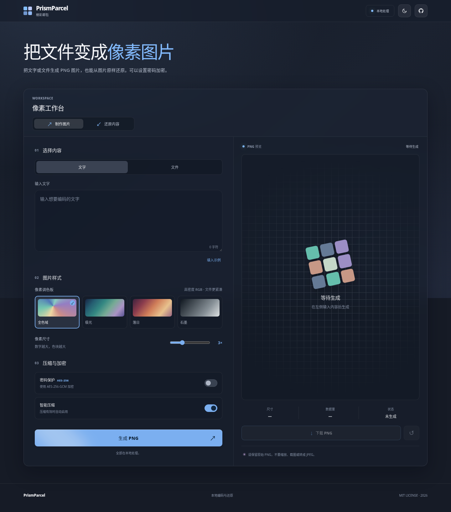
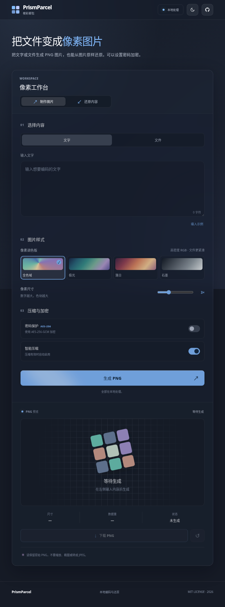
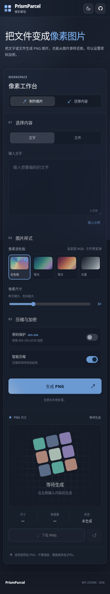

<div align="center">


# PrismParcel · 棱彩邮包

把文字和文件变成 PNG 图片，也能从图片完整还原。可选密码加密，全程在浏览器本地处理。

[使用说明](#怎么用) · [本地运行](#本地运行) · [安全说明](#安全说明) · [协议文档](docs/PROTOCOL.md)

</div>



## 功能

- **文字或文件 → PNG → 原始内容**：保留原始字节、文件名和文件类型。
- **四种颜色方案**：全色域、极光、落日、石墨。还原时自动识别。
- **可选密码加密**：PBKDF2-SHA-256 + AES-256-GCM。
- **智能压缩**：压缩后更小时才会使用 GZIP。
- **完整性校验**：通过 SHA-256 检查数据是否被修改。
- **WinUI 3 风格**：明暗主题、蓝色强调色、云母与亚克力质感的 Web 模拟效果，适配电脑、平板和手机。
- **本地处理**：无需账户，不上传输入的文件和密码。

> 不设置密码时，图片只是编码后的数据，**任何人都可能还原**。改变图片配色不等于加密。

## 怎么用

**生成图片**

1. 在「制作图片」里输入文字，或者选择文件。
2. 选择颜色方案和像素尺寸。文件太大时会自动选择能处理的像素尺寸。
3. 需要加密时，打开「密码保护」并输入密码。
4. 点击「生成 PNG」，再下载图片。

**还原内容**

1. 切换到「还原内容」，选择 PrismParcel 生成的原始 PNG。
2. 如果当时设置了密码，请输入密码。
3. 点击「还原内容」，复制文字或下载恢复的文件。

不要调整图片大小，不要截图，也不要把 PNG 转成 JPEG 或 WebP。发送给别人时请选择「原文件」。

## 本地运行

无需安装前端依赖。需要 Python 3 或任何静态文件服务器：

```bash
git clone https://github.com/LimAimo/PrismParcel.git
cd PrismParcel
python3 -m http.server 5173
```

浏览器打开 <http://localhost:5173>。部署到静态网站时请使用 HTTPS；Web Crypto 不支持不安全的网页环境。不建议直接双击 `index.html`。

## 容量和兼容性

- 单个数据包最多约 **12 MiB**（包含元数据、校验值和加密开销）。
- 默认最多渲染 **16 Mi 像素**，单边最多 **16,384 像素**。如果选择的像素尺寸过大，生成时会自动调小，并显示实际尺寸。
- 三种 16 色调色板会比全色域占用更多像素；特别大的文件建议选全色域。
- 只支持**原始 PNG** 的无损还原。新版协议**不兼容旧 TToIM 图片**，旧图片需用原版工具恢复。
- 页面会验证真实的 PNG 文件签名，避免把 JPEG、WebP 或错误扩展名当成 PNG。
- 现代 Chromium、Firefox 和 Safari 可运行；智能压缩依赖 `CompressionStream`，解压依赖 `DecompressionStream`。

## 安全说明

未设置密码的图片没有保密性。设置密码后，程序使用随机盐、随机 IV、PBKDF2-SHA-256（210,000 次迭代）和 AES-256-GCM。忘记密码无法恢复。项目尚未经过独立安全审计，不建议用于高风险机密资料。

处理过程在当前浏览器中完成，没有文件上传接口。不过，浏览器扩展、操作系统和下载目录仍可能接触数据。

## 开发和测试

```bash
npm run check
npm test
python3 tests/browser_smoke.py  # 可选；需要 Playwright、Chromium 和 cryptography
```

浏览器测试覆盖桌面、平板、手机上的生成与还原，包括默认示例的**全色域 8× 像素**、加密文字以及二进制文件。执行后会刷新以下截图。

<details>
<summary>平板与手机预览</summary>





</details>

项目采用 HTML、CSS 和 JavaScript，无前端框架和运行时依赖。`src/codec.mjs` 负责协议、压缩与加密，`src/app.mjs` 负责界面交互；详细格式见 [协议文档](docs/PROTOCOL.md)。

## 许可证

[MIT](LICENSE)。
